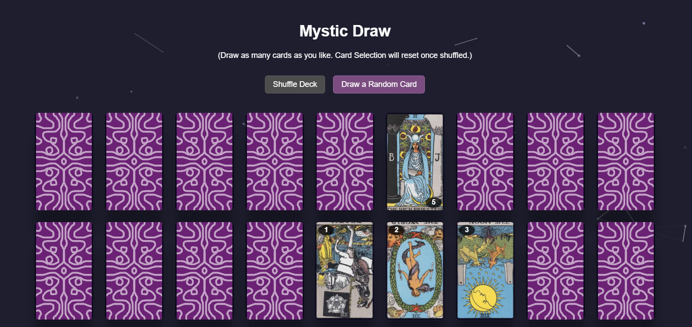
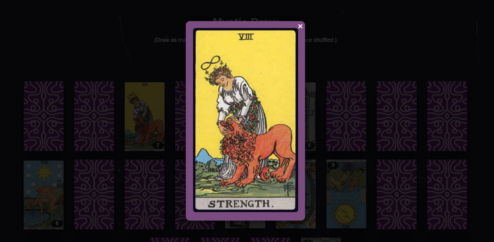
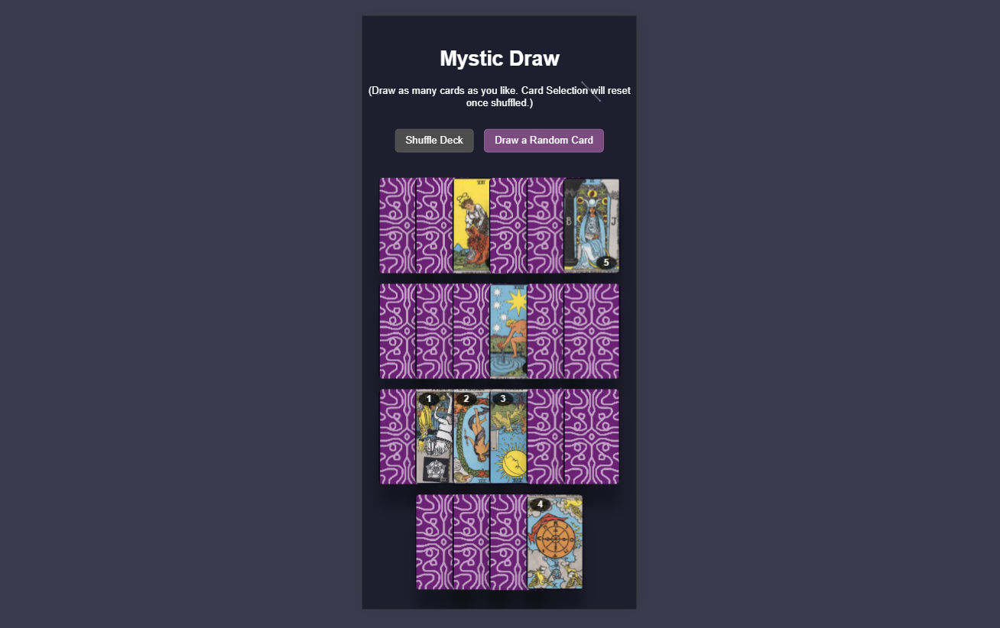
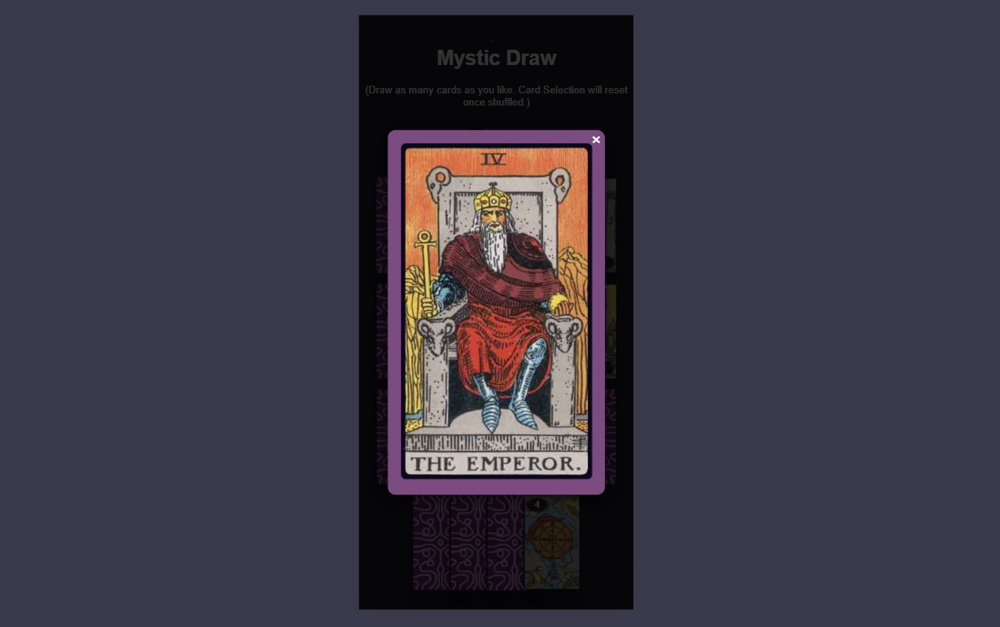

# mystic-draw

A tarot card picker built with HTML, CSS, and JavaScript. Draw as many cards as you like with animated flips, reversed orientation, and particle effects. Cards reset and reshuffle with a scatter animation. Fully responsive, including mobile stacking.

View live site [here](https://dianapadre.github.io/mystic-draw/).

